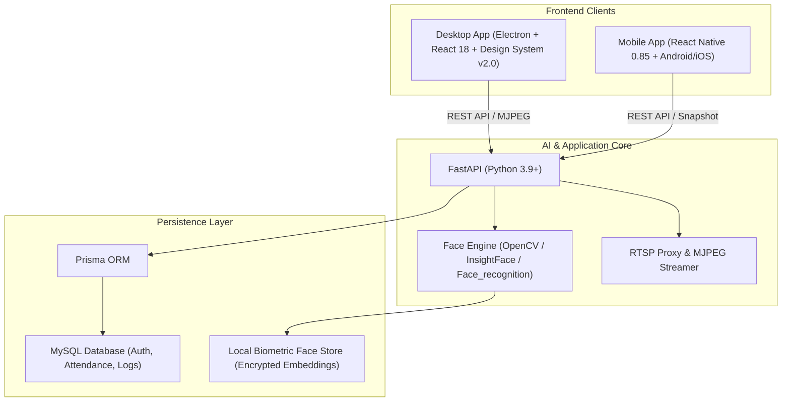

# CovaVision — Hệ Thống Chấm Công Sinh Trắc Học Khuôn Mặt

CovaVision là giải pháp chấm công bằng nhận diện khuôn mặt đa nền tảng độc lập, hiện đại và bảo mật cao, tách rời hoàn toàn khỏi các hệ thống cũ.

---

## 🏛️ Kiến Trúc Hệ Thống



- **`backend/`**: FastAPI backend duy nhất, chịu trách nhiệm nhận diện khuôn mặt sinh trắc học, quản lý nhân sự, camera proxy và chấm công.
- **`prisma/`**: Schema MySQL chuẩn hóa với quan hệ chặt chẽ giữa Organizations, Employees, Accounts, Cameras, AttendanceRecords.
- **`apps/desktop/`**: Ứng dụng Electron + React với **Design System v2.0**, hỗ trợ Dark/Light Theme, Glassmorphism, Recharts charts.
- **`apps/mobile/`**: Ứng dụng React Native hỗ trợ chấm công di động qua camera trước và quản trị nhanh.
- **`tests/`**: Kiểm thử hợp đồng API (Contract Tests), kiểm thử nghiệp vụ và bảo mật theo hướng TDD.

---

## ✨ Tính Năng Nổi Bật (Big Update v4)

### 1. Trải nghiệm Giao diện Cao cấp (Design System v2.0)
- **Dark / Light Mode**: Chuyển đổi giao diện sáng/tối mượt mà, tự động đồng bộ theo tùy chọn hệ điều hành.
- **Bento Grid Dashboard**: Hiển thị xu hướng chấm công 7 ngày (AreaChart) và tỷ lệ nhận diện (DonutChart) trực quan qua thư viện **Recharts**.
- **Quản lý Nhân sự Pro**: Hỗ trợ chuyển đổi giữa **Dạng bảng chi tiết (Table)** và **Dạng lưới thẻ (Grid Cards)**, xem ảnh khuôn mặt đã đăng ký.
- **Báo cáo chuyên sâu**: Lọc nhanh theo ngày (Hôm nay, 7 ngày, 30 ngày, Tháng này, Tùy chọn), phân trang và xuất file CSV định dạng `utf-8-sig` (hiển thị tiếng Việt chuẩn trên Excel).
- **Hộp thoại xác nhận (ConfirmDialog)**: Loại bỏ hộp thoại trình duyệt `window.confirm`, bảo vệ người dùng trước các thao tác nhầm lẫn.
- **Onboarding SaaS**: Đăng ký workspace bằng email, đăng nhập username/email và Google Identity Services (khi đã cấu hình client ID).
- **Gói nhân sự**: Dùng thử 14 ngày (3 nhân viên/3 khuôn mặt), Standard (10, 550.000đ/tháng), Pro (50, 1.950.000đ/tháng), VIP (150, 4.990.000đ/tháng), Business liên hệ.
- **Thanh toán SePay**: Tạo order server-side, QR VietQR, webhook có API key, kiểm tra số tiền/nội dung/hạn đơn và idempotency; credential ngân hàng không đi xuống client.
- **Theme CovaSol**: Hệ màu variable được chuẩn hóa theo [CovaSol](https://covasol.com.vn/) với xanh navy/xanh teal/xanh lá, Be Vietnam Pro và Nunito.

### 2. Bảo mật & Hiệu năng Cao
- **Chống brute-force**: Tích hợp Rate Limiting trên endpoint đăng nhập (`/api/v1/auth/login`).
- **An toàn khóa JWT**: Tự động kiểm tra phát hiện và cảnh báo nếu sử dụng `JWT_SECRET` mặc định trong môi trường production.
- **Bảo vệ RAM DoS**: Giới hạn kích thước file upload ảnh tối đa 10 MB.
- **Phân quyền chặt chẽ**: Chỉ có tài khoản Quản trị (`ADMIN`, `HR_MANAGER`) mới có quyền thay đổi thông số hệ thống và mở/khóa tài khoản.
- **Bảo mật Camera RTSP**: Luồng RTSP và mật khẩu camera được proxy an toàn tại backend, không bao giờ lộ ra ngoài giao diện người dùng.

---

## 🚀 Cài Đặt và Khởi Chạy Nhanh

### Yêu cầu môi trường
- macOS 12+, Linux hoặc Windows 10/11 (hỗ trợ native PowerShell/BAT và Laragon MySQL)
- **Python**: 3.9 trở lên
- **Node.js**: 18 trở lên & npm
- **MySQL**: 8.0 hoặc 8.4 (Laragon MySQL trên Windows, Homebrew MySQL trên macOS)

### 1. Cài đặt tự động qua Script

#### 🪟 Trên Windows:
Bạn có thể nhấp đúp chuột vào file `.bat` hoặc chạy qua PowerShell:

```powershell
# 1. Cài đặt môi trường, dependencies và đồng bộ database MySQL (Laragon):
.\scripts\windows\install.bat   # hoặc: .\scripts\windows\install.ps1

# 2. Khởi động cả FastAPI backend và Electron Desktop App:
.\scripts\windows\start.bat     # hoặc: .\scripts\windows\start.ps1

# 3. Dừng hệ thống:
.\scripts\windows\stop.bat      # hoặc: .\scripts\windows\stop.ps1
```

#### 🍎 Trên macOS / Linux:

```bash
chmod +x scripts/macos/*.sh scripts/*.sh

# Khởi tạo môi trường ảo Python, cài đặt dependencies và thiết lập database
COVAVISION_BOOTSTRAP_USERNAME=admin \
COVAVISION_BOOTSTRAP_PASSWORD='MatKhauBaoMat123' \
./scripts/macos/install.sh       # hoặc ./scripts/setup_local.sh

# Khởi động cả FastAPI backend và Electron Desktop App
./scripts/macos/start.sh         # hoặc ./scripts/start_project.sh
```

Dừng hệ thống:
```bash
./scripts/macos/stop.sh             # Dừng backend và Electron, giữ MySQL
./scripts/macos/stop.sh --database  # Dừng cả MySQL Homebrew service
```

---

## 🧪 Kiểm Thử Tự Động (Test Suites)

### 1. Backend Unit & Security Tests (Python pytest)
Hệ thống có 39 kịch bản kiểm thử API contracts, billing, bảo mật, nhận diện khuôn mặt và camera discovery:

```bash
.venv/bin/python -m pytest tests/ -v
# Kết quả: 39 passed, 1 warning nếu dùng JWT_SECRET mặc định ở local
```

### 2. Desktop Frontend Build Test (Vite)
```bash
cd apps/desktop
npm run build:react
# Kết quả: Vite build production hoàn thành sạch sẽ, không có lỗi module
```

### 3. Mobile App Test Suite (Jest)
```bash
cd apps/mobile
npm test
# Kết quả: 5 test suites passed, 9 tests passed
```

Chạy toàn bộ kiểm thử và build kiểm tra bằng một lệnh từ thư mục gốc:

```bash
./scripts/test_all.sh
```

---

## 🌐 Quét Camera Trong Mạng LAN (ONVIF)

1. Mở trang **Quản lý Camera** trên Desktop (hoặc Mobile).
2. Nhấn nút **Quét LAN**.
3. Backend sẽ gửi gói tin ONVIF WS-Discovery dò tìm tất cả camera an ninh IP trong mạng nội bộ.
4. Nếu camera không hỗ trợ ONVIF, đánh dấu vào tùy chọn **Quét bổ sung toàn bộ subnet /24**.
5. Nhập tên hiển thị, tài khoản và mật khẩu camera để lưu vào hệ thống an toàn.

## 💳 Cấu hình Google và SePay

Đăng nhập Google cần dùng cùng một OAuth Web Client ID ở hai nơi:

```bash
# .env
GOOGLE_CLIENT_ID=...apps.googleusercontent.com

# apps/desktop/.env.local
VITE_GOOGLE_CLIENT_ID=...apps.googleusercontent.com
```

Thanh toán cần đặt thông tin nhận tiền ở backend; không đưa API key vào desktop/mobile:

```bash
SEPAY_BANK_ACCOUNT=0123456789
SEPAY_BANK_CODE=VCB
SEPAY_WEBHOOK_API_KEY=secret-from-sepay
SEPAY_ORDER_PREFIX=CV
```

Webhook production phải là HTTPS public URL trỏ tới `/api/v1/billing/webhooks/sepay`. Backend chỉ kích hoạt khi đúng order, đúng số tiền, chưa hết hạn và chưa xử lý trước đó. Xem thêm [tài liệu webhook SePay](https://developer.sepay.vn/vi/sepay-webhooks/tich-hop-webhook).

Business logic điểm danh chỉ ghi nhận khi có ảnh nhận diện khuôn mặt. Endpoint `POST /api/v1/attendance` dạng thủ công bị từ chối để không thể giả mạo record bằng `employee_id` từ client.

---

## 📦 Đóng Gói Ứng Dụng (Production Packaging)

### Desktop App (Electron Builder)
```bash
cd apps/desktop
# Install PyInstaller and vision dependencies before creating a self-contained release.
python -m pip install -e ".[dev,vision,packaging]"
# Point this at a directory containing models/buffalo_s.
COVAVISION_MODEL_DIR=/path/to/insightface_models \
npm run build:electron
# Tạo bộ cài .dmg / .app cho macOS hoặc .exe cho Windows trong thư mục apps/desktop/release/
```

The self-contained desktop release starts the bundled Python backend on `127.0.0.1:8000` and includes the Prisma schema plus InsightFace model. Use `npm run build:electron:no-backend` only when an external backend is intentionally configured.

Before a schema update or deployment, create a MySQL backup with
`scripts\\windows\\backup.ps1` or `scripts/macos/backup.sh`. The database
password is passed through `MYSQL_PWD` and never appears in the command line.
For a migration-aware deployment, use `scripts\\windows\\migrate.ps1` or
`scripts/macos/migrate.sh`; it creates the backup first and then runs
`prisma migrate deploy`. Existing databases created only with `db push` must be
baselined once with `prisma migrate resolve --applied 20260920120000_initial`
after verifying that their schema matches the tracked baseline.

### Mobile App (Android APK)
```bash
cd apps/mobile
./build_apk.sh
# Tạo file APK cài đặt độc lập tại apps/mobile/android/app/build/outputs/apk/release/
```

---

## 🔒 Quy Định Bảo Mật Dữ Liệu
- Không commit file `.env`, mật khẩu, database dump hoặc vector embeddings thực tế lên Git.
- Dữ liệu khuôn mặt được lưu trữ cục bộ trong thư mục `data/` (đã nằm trong `.gitignore`).
- Luôn thay đổi `JWT_SECRET` trong file `.env` trước khi triển khai môi trường Production thực tế.
